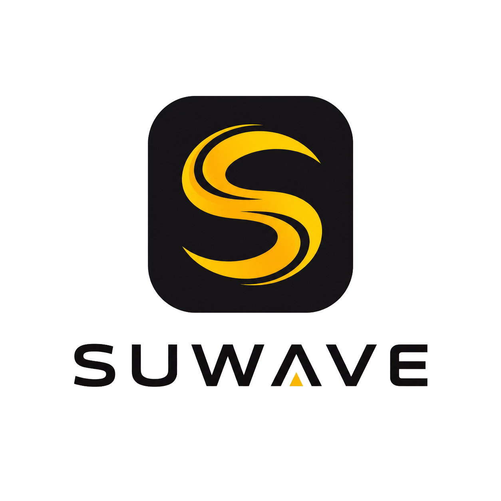
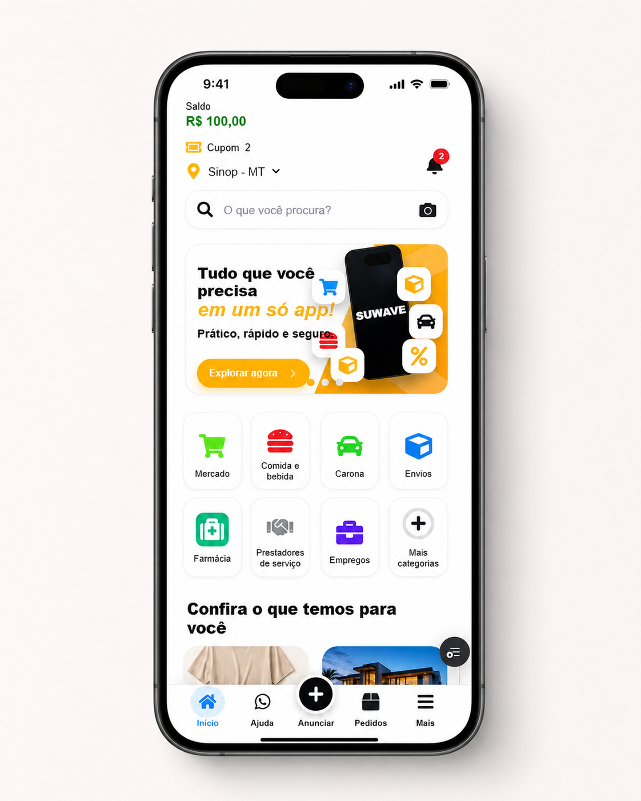
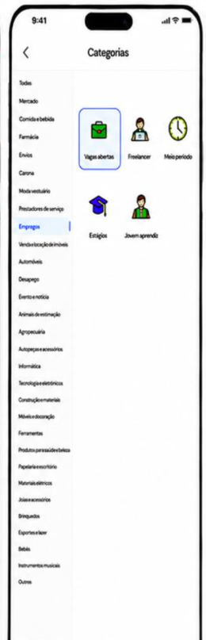
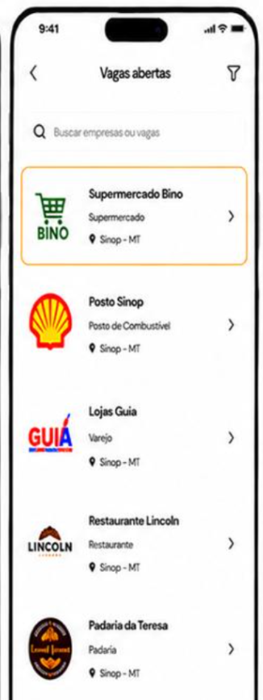
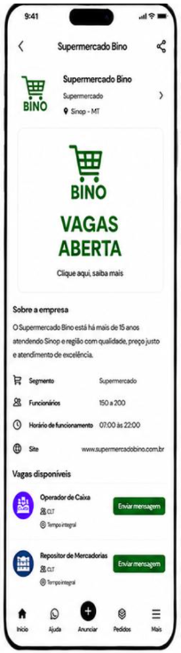
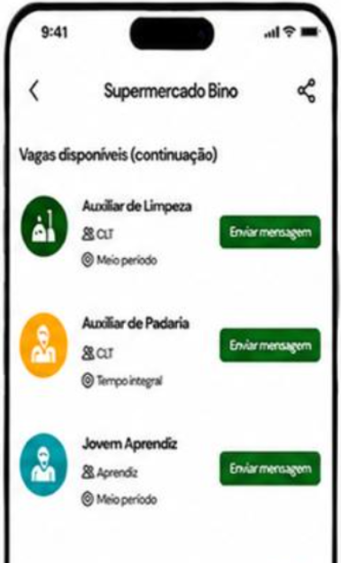

# Suwave

<p align="center">
  
</p>

<p align="center">
  <strong>Uma experiência mobile de marketplace com cara de aplicativo.</strong>
</p>

<p align="center">
  Compra, venda, serviços e oportunidades em uma interface visual, rápida e feita para navegar no celular.
</p>

<p align="center">
  
  
  
  
</p>

## Sobre

Suwave é um protótipo de marketplace mobile construído com foco em navegação simples, categorias visuais e fluxos que lembram um app nativo.

O projeto reúne uma home promocional, cards de ofertas, categorias de serviços e um fluxo de empregos que leva o usuário do menu de vagas até o detalhe de uma empresa com oportunidades disponíveis.

## Preview

<p align="center">
  
</p>

### Fluxo de empregos

<p align="center">
  
  
  
  
</p>

## Destaques

- Home mobile com banner promocional, busca e navegação inferior.
- Categorias com ícones, estados selecionados e menu lateral.
- Fluxo de `Empregos` com vagas abertas e detalhe da empresa.
- Lista de vagas com cargo, modalidade e ação de contato.
- Convite de instalação no celular com suporte progressivo a PWA.
- Manifest e ícones dedicados para instalação.
- Animações de transição e microinterações com Motion.
- Layout adaptado para celular real e apresentação em moldura de aparelho no desktop.

## Tecnologias

| Tecnologia | Uso |
| --- | --- |
| Next.js 16 | App Router, metadata e manifest |
| React 19 | Componentes e estados interativos |
| TypeScript | Tipagem do projeto |
| Motion | Animações e transições |
| React Icons | Ícones da interface |
| CSS Modules | Estilos do fluxo mobile |

## Rodando localmente

```bash
npm install
npm run dev
```

Abra o endereço exibido pelo Next.js no terminal.

### Comandos úteis

```bash
npm run build
npm run lint
```

## Estrutura principal

```text
src/app/
  _components/
    app-shell.tsx
    suwave-home.module.css
  companies/
    [companySlug]/
  home/
    _components/
  jobs/
    companies/
      page.tsx
    page.tsx
  listings/
    vehicles/
      pickups/
        page.tsx
    page.tsx
  layout.tsx
  manifest.ts
  page.tsx

src/models/
src/repositories/
src/shared/

preview/
  atual/
  emprego/

public/
  marketplace/
  suwave-icon-192.png
  suwave-icon-512.png
  suwave-logo-transparent.png
```

## PWA

O projeto inclui manifest, ícones de instalação e um bottom sheet que convida o usuário a instalar a experiência no celular.

Em navegadores compatíveis, o fluxo usa o prompt nativo de instalação. Em iPhone, a interface orienta o usuário a adicionar o app à Tela de Início pelo menu de compartilhamento.

## Status

O projeto está em evolução. O fluxo visual principal e a jornada de empregos já estão modelados, enquanto novas categorias e telas podem ser conectadas a partir da base existente.

---

<p align="center">
  Feito para explorar como um marketplace local pode ficar leve, visual e acolhedor no celular.
</p>
